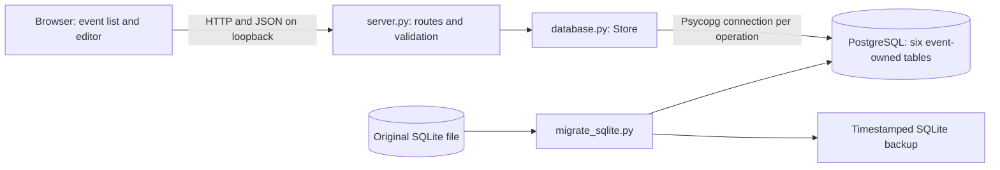

# Architecture and source map

This build is a local, single-user event and registration-page draft workspace. The browser loads HTML, CSS and JavaScript from a Python HTTP server on `127.0.0.1:8765`. JavaScript calls same-origin JSON endpoints. The server validates input and uses Psycopg to read and write local PostgreSQL. No cloud service or existing main-Regfire backend is connected.

| Source | Responsibility |
| --- | --- |
| `server.py` | Static-file allowlist, JSON API, validation, timestamps, UUID creation, HTTP startup |
| `database.py` | Private configuration loader, PostgreSQL connection, schema initialization, list/save transactions |
| `setup_postgres.py` | Interactive administrator authentication, new app account/database, generated app credential |
| `registration.py` | Page validation, timezone-aware dated rates, default policy and pricing resolution |
| `assets.py` | Image-content validation, orientation/size normalization and metadata stripping |
| `migrations/002_registration_assets.sql` | Additive event-owned image metadata table and index |
| `uploads/` | Immutable normalized PNG assets, excluded from source control |
| `migrations/001_registration_pages.sql` | Additive page table with event foreign key; applied transactionally at startup |
| `static/builder.js` | Organizer page authoring, RegTypes/prices/visibility and local attendee-style preview |
| `migrate_sqlite.py` | Consistent SQLite backup and transactional import without overwriting records |
| `static/index.html` | Event form, saved list, draft status and accessible labels |
| `static/style.css` | Regfire charcoal/orange design and desktop/mobile layouts |
| `static/app.js` | Fetch requests, selected draft, unsaved-change handling, format switching and save feedback |
| `tests/test_events.py` | Validation and isolated PostgreSQL integration tests |
| `requirements.txt` | Pinned Psycopg dependency, including binary driver |
| `.local/postgres.json` | Private connection settings; excluded from source control and never served over HTTP |
| `data/regfire.sqlite3` | Preserved original database; no longer the active store |
| `backups/` | Recovery artifacts, excluded from source control |

Paths above are relative to the Regfire source folder. There is no framework build, frontend package manager, worker queue, connection pool, authentication layer or ORM. Python's threaded HTTP server handles local requests; each database operation opens and closes its own connection with a five-second connection timeout. Successful transaction contexts commit; exceptions roll back.

## User flow and state

The app loads timezones, then saved drafts. New events default to the browser timezone and in-person format. A user supplies a name and saves; optional details can be added later. The API additionally requires a timezone and format, which the UI supplies. Saved events appear in the sidebar and can be reopened and edited.

Saving is explicit, not automatic. Unsaved changes remain in browser memory and trigger a warning when switching drafts or leaving the page. Reloading does not recover unsaved inputs. On a save error, the form stays populated. A failed list load displays a retry-by-reload message.

Venue/location and online-link values are retained when switching format. Only the chosen format is displayed. The browser disables the hidden URL input but explicitly includes its retained value in the request; therefore an invalid retained URL can still fail server validation for an in-person event.

After a save, the browser moves the saved event to the top of its current list. Reloads use database ordering: latest `updated` first, then ID. Other open tabs are not refreshed automatically. Row locks serialize edits, but there is no version check: later saves overwrite earlier field values.

The optional `document.modelContext` integration exposes `list_event_drafts`, a read-only browser tool. Unsupported browsers continue normally. It does not expose create/edit tools.

## Boundaries and deferred work

Implemented: create/list/edit event drafts; per-event registration-page authoring; stable RegTypes with exact prices and event currency; conditional field visibility; phone and structured address; local preview with visible-field validation; PostgreSQL persistence; safe SQLite import and additive schema migration; responsive UI and isolated integration checks.

Not implemented: event publishing, live attendee submissions/records, payment processing, taxes/discounts, capacity/access rules, emails, badges, printers, scanning, login, user roles, cloud hosting/sync, audit history, optimistic concurrency, pagination, scheduled backups, migration-history tracking or production deployment hardening. Cloud migration is explicitly deferred.

The app account owns its database and schema but has no superuser, create-database or create-role privileges. This is not a finely separated production permission model. The HTTP app has no user authentication or TLS; origin comparison on writes is limited protection, not a security boundary for public hosting. Keep it local. Only explicitly allowlisted static paths are served, so source, settings and backups are not exposed by the HTTP file handler.

## Brand asset

`static/regfire-logo.png` is an unchanged copy of the user's downloaded Regfire logo, `ChatGPT Image Sep 29, 2026, 12_50_51 PM.png`. The second inspected download was Ignite360 and is not used. The header displays the complete Regfire image on its original white background; the favicon uses the same asset.

CSS brand tokens use charcoal `#191a1e`, deep red `#a60000`, red `#cf1600`, vivid orange `#ff6a00` and gold `#ffbd18`. These are interface choices consistent with the supplied image, not a claim of an official sampled brand specification. Primary buttons use a darker red-orange `#b52008` for legible white labels. Bright orange is reserved for accents, borders and focus indicators; gold marks draft status. Neutral form surfaces stay light for readability.

The Events sidebar uses a charcoal-to-deep-red background (`#191a1e` through `#291517` to `#590e0e`), light text and muted rose metadata. Its New event action uses gold with dark text. Saved-draft hover and selected states use lighter surfaces, orange borders and a gold selected edge; keyboard focus remains visible in gold. The same navigation treatment applies on narrow screens.

## Registration builder flow

The saved-event workspace has Event details and Registration page views. Builder loads use a request-generation guard so a late response for another event cannot replace the current editor. Event IDs are in local URL fragments for reload navigation. Unsaved-state warnings cover both editors, and saves disable organizer controls until completion. The page preview is a separate browser form; no entered answers are sent to the API.

Each event has at most one page definition, plus any number of uploaded assets. Saving uses an atomic PostgreSQL upsert keyed by event ID. Editing remains last-save-wins across tabs; stable field/RegType IDs preserve references inside a draft but are not authorization controls. See the builder guide and database reference for details.

## Pricing and image data flow

The browser sends the current unsaved page definition and optional local test time to `POST /api/events/{id}/pricing-preview`. The server validates the full definition using the stored event timezone and resolves scheduled/default/unavailable rates. This endpoint writes nothing. The UI debounces edits and ignores stale pricing responses; preview answers are never included. Rate settings remain in page JSON; older single-price records are interpreted as an enabled default and are not rewritten until saved.

Image uploads are binary POSTs. Pillow verifies content, normalizes static images to PNG and strips metadata. Store writes a UUID filename and an event-scoped metadata record; filesystem writes are removed if their database transaction fails. Saved page JSON references asset IDs, checked against event ownership and kind. Files remain immutable on replacement/removal. Asset GET validates both event and asset IDs and reads only the generated filename under the upload root. The background is a separate faded CSS layer around the opaque form card.

Field drag uses pointer capture only on dedicated handles, with drop feedback and edge scrolling. It commits one array reorder on release and leaves the same field objects/IDs intact. Keyboard up/down controls use the same order and save pipeline.

## Current organizer extensions

The organizer sequence is Event details → Registration page → Demographics → Membership. Successful event saves advance to Registration page; validation/network failures retain the event form. Deletion uses an event-name confirmation and cascades related configuration. Demographics has an organizer definition editor and a separate labeled, non-collecting embedded website preview. Membership is a separate settings/import/verification preview.

`demographics.py` validates/evaluates acyclic, ordered branching; `membership.py` handles strict CSV normalization and a bounded HTTPS adapter; `address_lookup.py` handles optional fixed-provider suggestions. Their browser modules are `demographics.js`, `membership.js`, `address.js`. `live-editor.js` streams safe page-definition snapshots to `preview.html`/`live-preview.js`, scoped to event and editor session. No attendee answers are persisted.

A static, noninteractive gold/orange radial glow decorates the unused sidebar area. The existing Regfire logo and charcoal/red/gold branding are retained.

Provider integration limits: no live membership provider has been verified; Geoapify requires an organizer-owned key and explicit environment enablement. Fixture testing does not establish live provider service availability. Local-only, no authentication, no attendee submissions, no payment collection, no public hosting and no real manual-review queue remain deliberate limits.
